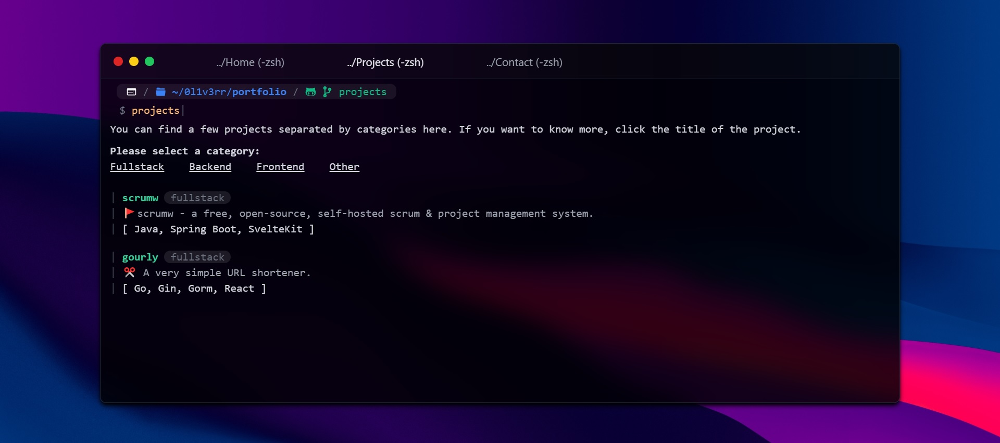

# 0l1v3rr - Personal Website
This is a MacOS Terminal like responsive personal website.  
The site is deployed to GitHub pages. You can visit it by clicking [here](https://0l1v3rr.github.io/).



## Tech Stack
- React
- React Router
- Tailwind
- TypeScript

## Building from source
You can build this app from the source very easily.  
Clone this repository:
```sh
git clone https://github.com/0l1v3rr/0l1v3rr.github.io.git
cd 0l1v3rr.github.io
```
Install the necessary dependencies:
```sh
npm i
```
Run the application:
```sh
npm start
```

## Useful resources:
If you want to deploy your SPA to GitHub pages as I did, here are some useful links that may help you:  
- [https://github.com/gitname/react-gh-pages](https://github.com/gitname/react-gh-pages)
- [https://github.com/rafgraph/spa-github-pages](https://github.com/rafgraph/spa-github-pages)